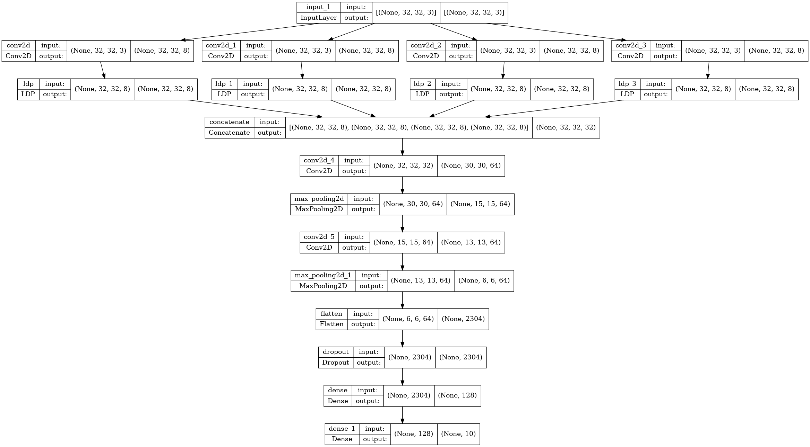

# A custom TensorFlow layer for local derivative patterns 
[Akgun, Devrim. "TensorFlow based deep learning layer for Local Derivative Patterns." Software Impacts 14 (2022): 100452 https://doi.org/10.1016/j.simpa.2022.100452](https://www.sciencedirect.com/science/article/pii/S2665963822001361)

## Example evaluation on Cifar10: ldp_test.py

###  Training results:

###  Validation results:

###  Evaluation on test dataset:
test acc for model_ldp :  0.708899974822998

test acc for model_base:  0.6478000283241272

## Example usages:
### Separately:
  x1 = LDP(mode='single', alpha='0')(x1)    
  x2 = LDP(mode='single',alpha='45')(x2)    
  x3 = LDP(mode='single',alpha='90')(x3)    
  x4 = LDP(mode='single',alpha='135')(x4)   
### Mean of LDP 0, LDP 45, LDP 90,and LDP 135:   
  x = LDP(mode='mean')(x)   
### Separate features:   
  x = LDP(mode='multi')(x)    
  

## Processing Cifar10 dataset with LDP:
### Replace Cifar10 with your dataset for processing in the example file cifar_text.py

## Example test model that uses four directions:

##  LDP 0 features:

##  LDP 45 features:

##  LDP 90 features:

##  LDP 135 features:

@article{akgun2022tensorflow,
  title={TensorFlow based deep learning layer for Local Derivative Patterns},
  author={Akgun, Devrim},
  journal={Software Impacts},
  volume={14},
  pages={100452},
  year={2022},
  publisher={Elsevier}
}
