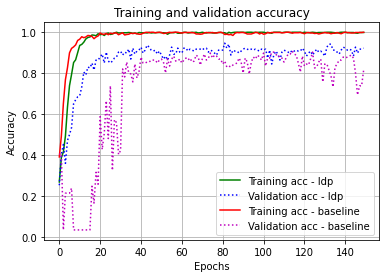
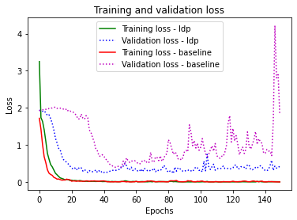
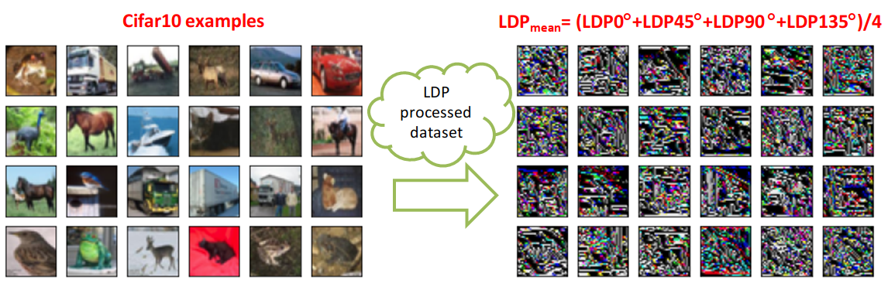
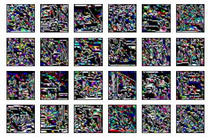
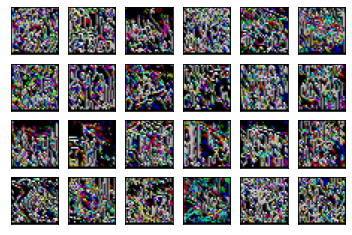

# A custom TensorFlow layer for local derivative patterns 

This repository contains the Local Derivative Patterns as a Deep Learning layer implemented in the paper. The example on LFW - Labeled Faces in the Wild dataset compares a model with LDP layers and a baseline CNN model. 
## Example evaluation on LFW - Labeled Faces in the Wild dataset: ldp_test.py

###  Training results:

###  Validation results:

###  Evaluation on test dataset:
model_ldp - test accuracies for example runs:

0.9342 0.9473, 0.9429, 0.9298, 0.8991, 0.9078, 0.9342, 0.9254, 0.9122, 0.9166 

model_base - test accuracies for example runs:

0.9122, 0.9035, 0.9035, 0.8947, 0.9035, 0.9078, 0.9210, 0.8991, 0.9078, 0.9122

## Example usages:
### Separately:
  x1 = LDP(mode='single', alpha='0')(x1)    
  x2 = LDP(mode='single',alpha='45')(x2)    
  x3 = LDP(mode='single',alpha='90')(x3)    
  x4 = LDP(mode='single',alpha='135')(x4)   
### Mean of LDP 0, LDP 45, LDP 90,and LDP 135:   
  x = LDP(mode='mean')(x)   
### Separate features:   
  x = LDP(mode='multi')(x)    
  
## Processing Cifar10 dataset with LDP:
### Replace Cifar10 with your dataset for processing in the example file cifar_text.py

##  LDP 0 features:

##  LDP 45 features:

##  LDP 90 features:

##  LDP 135 features:

Reference study:

[Akgun, Devrim. "TensorFlow based deep learning layer for Local Derivative Patterns." Software Impacts 14 (2022): 100452 https://doi.org/10.1016/j.simpa.2022.100452](https://www.sciencedirect.com/science/article/pii/S2665963822001361)

Similar studies:

https://github.com/dwday/lbp_tensorflow_python

https://github.com/dwday/lbp_pytorch_python-
