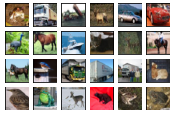
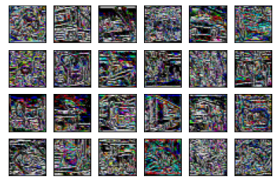

# A custom TensorFlow layer for local derivative patterns 
[Akgun, Devrim. "TensorFlow based deep learning layer for Local Derivative Patterns." Software Impacts 14 (2022): 100452 https://doi.org/10.1016/j.simpa.2022.100452](https://www.sciencedirect.com/science/article/pii/S2665963822001361)
Abstract: Deep learning architectures can extract features automatically via particular layers such as convolutions, recurrent networks, and pooling operations. In addition to the predefined layers in TensorFlow, developers can implement their custom layers based on the existing operators. This study presents a new library for using the Local Derivative Pattern (LDP) algorithm as a deep learning layer. The LDP layer has no trainable parameters and extracts the local patterns in four directions. The layer’s output provides the features to the following layers separately or combined. The developed library enables integrating LDP into any desired model that works with two-dimensional input data.

## Example usages:
### Separately:
  x1 = LDP(mode='single', alpha='0')(x1)    
  x2 = LDP(mode='single',alpha='45')(x2)    
  x3 = LDP(mode='single',alpha='90')(x3)    
  x4 = LDP(mode='single',alpha='135')(x4)   
### Mean of LDP 0, LDP 45, LDP 90,and LDP 135:   
  x = LDP(mode='mean')(x)   
### Separate features:   
  x = LDP(mode='multi')(x)    
  
## Example test model that uses four directions:

## Using LDP for processing Cifar10: Replace Cifar10 with your dataset for processing in the example file cifar_text.py

##  Mean LDP features:

##  Mean LDP 0 features:

##  Mean LDP 45 features:

##  Mean LDP 90 features:

##  Mean LDP 135 features:

@article{akgun2022tensorflow,
  title={TensorFlow based deep learning layer for Local Derivative Patterns},
  author={Akgun, Devrim},
  journal={Software Impacts},
  volume={14},
  pages={100452},
  year={2022},
  publisher={Elsevier}
}
